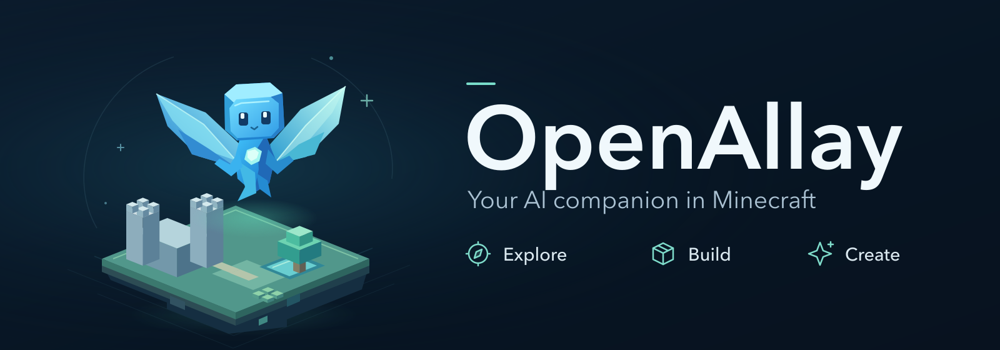
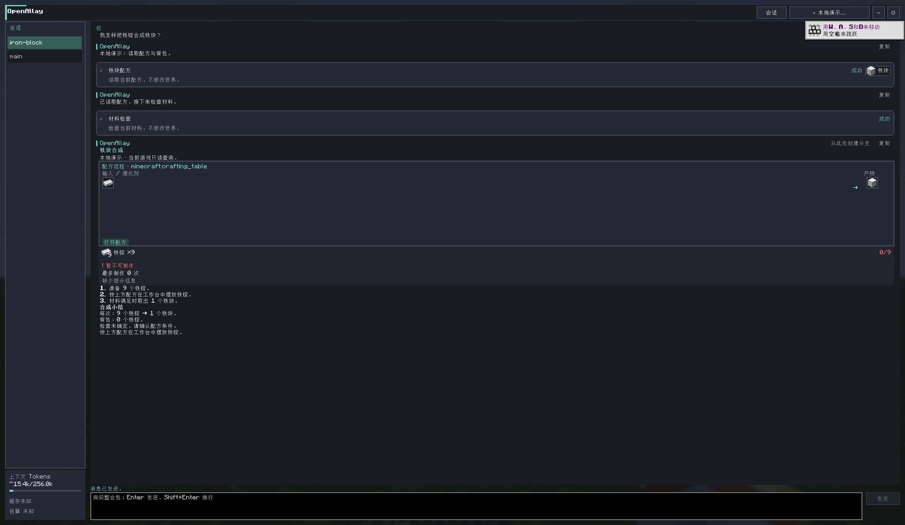
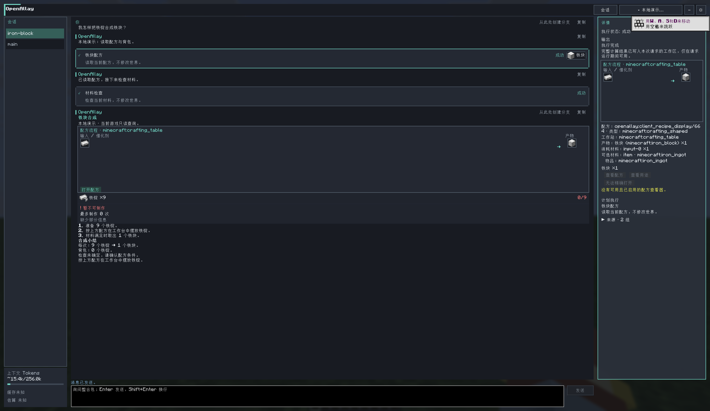
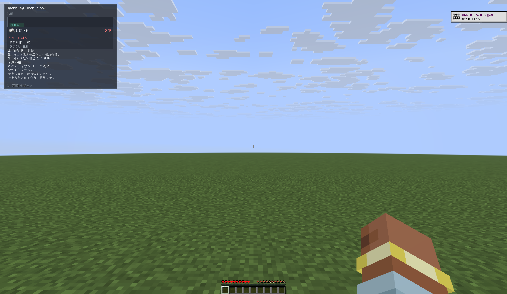
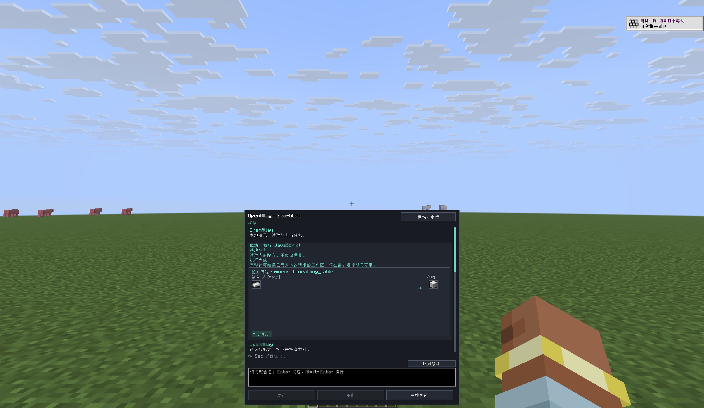
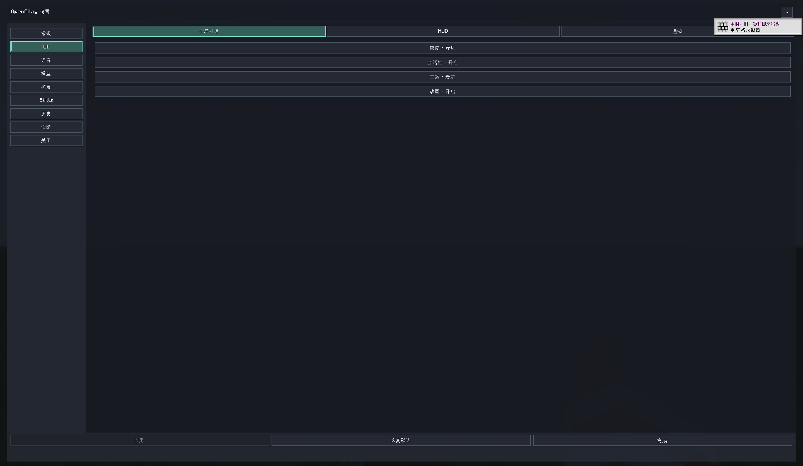
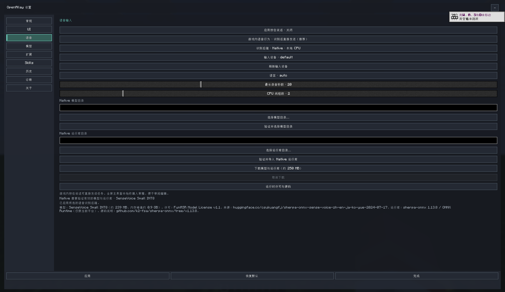
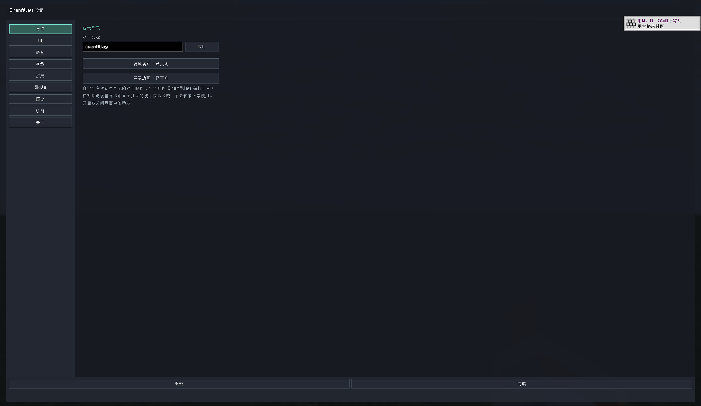
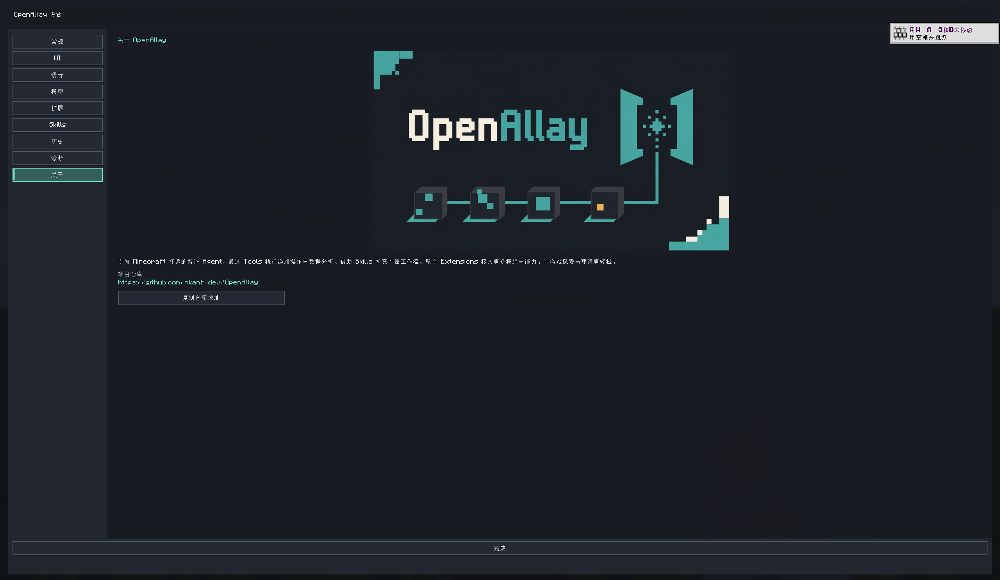

# OpenAllay

[English](README.md)

**你的 Minecraft AI 伙伴：探索整合包、解答游戏问题，把建造想法变成现实。**

像聊天一样说出需求。OpenAllay 会利用当前游戏中可用的数据，逐步完成任务，
把有用的答案带回游戏。

[GitHub 下载](https://github.com/nkanf-dev/OpenAllay/releases) ·
[快速上手](#快速上手) · [0.4.2 更新说明](docs/releases/0.4.2.md) ·
[社区与开发](#社区与开发)

| | 让它融入你的玩法 |
| --- | --- |
| **[探索](#探索你的整合包)** | 查配方、比装备、核对材料，理清整合包里的玩法。 |
| **[建造](#在你的世界里建造)** | 整理地形、搭建建筑，在单人世界中保存并复用结构模板。 |
| **[Skills](#打造自己的-skills)** | 为你喜欢的模组和玩法，添加专属工作流与知识。 |
| **[Extensions](#用-extensions-扩展能力)** | 接入更多模组、游戏数据、操作能力与原生结果视图。 |

## 快速上手

OpenAllay **0.4.2** 面向 **Minecraft 26.2**，需要 **Java 25**，支持
**Fabric 和 NeoForge**。请在
[GitHub Releases](https://github.com/nkanf-dev/OpenAllay/releases)
查看已发布的下载包，并选择对应加载器的 JAR。Fabric 还需要安装匹配的
**Fabric API**。

1. 把 JAR 放入游戏实例的 `mods` 文件夹，启动 Minecraft。
2. 进入世界，按 **K**，或输入 `/guide`。
3. 点击齿轮按钮 → **模型**，添加模型配置。
4. 选择 **OpenAI 兼容 Chat Completions** 或 **Anthropic Messages**，
   填写服务地址、模型 ID 和 API 密钥。
5. 检查上下文窗口与最大输出。匹配到的模型会自动填写；如果服务商或模型目录
   没有提供这些值，请手动填写。
6. 保存后，在对话顶部选中这个配置，开始提问。

不妨先问：**“这个物品怎么合成？我背包里的材料够吗？”**

如果 Fabric 整合包包含 Architectury，请使用 **21.0.4**。
**21.0.2 及更早版本**会导致文字输入失效。Architectury 不是必需项。

## 探索你的整合包

少在 Wiki、配方页面和指南书之间来回切换。OpenAllay 可以在同一段对话中
关联配方、物品、背包、已安装模组、设置与附近的游戏信息，也能一次比较
整个集合，不必每轮只查一个物品。

- “这个整合包里，基础伤害最高的剑是哪一把？”
- “按营养值比较农夫乐事里的食物。”
- “苹果酒怎么做？我背包里的材料够吗？”
- “在已安装的指南书里搜索魔法作物。”
- “现在启用了哪些资源包？视频设置是什么？”

回答可以直接展示物品图标、材料槽位、配方布局、表格和可展开详情。
工具卡片会清晰展示 Agent 执行的操作与结果。数据量较大时会自动提供易读的折叠预览。

可选集成包括 **JEI**、**REI**、**Patchouli**，以及
**Farmer's Delight（农夫乐事）**等配方丰富的模组。能读取哪些数据，取决于当前安装的模组及其集成；
使用 OpenAllay 不要求安装这些模组。

## 在你的世界里建造

Fabric 和 NeoForge 下载包都包含 **Minecraft Builder** 扩展。
说出你想建什么，再通过几何体、地形工具、建筑预设和结构模板，
把想法落到当前单人世界里。模板支持旋转与镜像；方块撤销会检查后续改动，
遇到冲突时报告，而不是直接覆盖。

开始建造只需：

1. 进入**单人世界**，选择在自己客户端配置的模型，而不是服务器提供的共享模型。
2. 打开**设置 → 扩展**，选择 **Minecraft Builder**，在**扩展原生操作**中
   启用 **Builder world writes（Builder 世界写入）**。
3. 提出建造需求，例如：“在我旁边建一座小石塔。”

世界写入默认关闭，只为 Builder 单独开启。
**不需要启用无限制 JavaScript 或 JVM 访问。** Builder 支持生存与创造世界，
不向普通远程服务器写入方块。撤销针对记录下来的方块改动，不是整个世界的完整回滚。

Builder 在
[OpenAllay Extensions](https://github.com/nkanf-dev/OpenAllay-Extensions/tree/main/extensions/minecraft-builder)
中独立开发。

## 打造自己的 Skills

让 OpenAllay 更懂你的玩法。Skills 是可复用的任务指导与参考资料，
可以围绕一个模组、一类任务或一种玩法编写，而不是再增加一排固定按钮。
OpenAllay 会在需要时加载相关指导。

内置 Skills 已覆盖配方、机器、指南书、游戏进度与问题诊断。
在**设置 → Skills** 中，你可以浏览、安装和更新社区工作流，也可以导入本地
Skill 安装包。想写自己的整合包指南或专属工作流？欢迎到
[OpenAllay Skills](https://github.com/nkanf-dev/OpenAllay-Skills)
创作和分享。

## 用 Extensions 扩展能力

Extensions 可以接入新的游戏数据、可复用 JavaScript 模块、模组集成、
操作能力与原生结果视图。在**设置 → 扩展**中查看已连接的能力、浏览兼容的
社区安装包，或导入本地 Extension JAR。Extensions 像普通模组一样安装，
重启游戏后生效。

想让自己的模组接入 OpenAllay？请从
[OpenAllay Extensions](https://github.com/nkanf-dev/OpenAllay-Extensions)
的示例和开发指南开始。

## 就在游戏里

| 全屏对话 | 原生配方详情 |
| --- | --- |
|  |  |

| 游戏内 HUD | HUD 全文阅读器 |
| --- | --- |
|  |  |

*截图来自 OpenAllay 0.4.0 的独立演示世界；示例对话使用本地固定响应的演示端点。*

为不同项目保留独立会话，随时回看历史、复制回答，或导出整段对话。
OpenAllay 界面不会暂停游戏。

- **Enter** 发送，**Shift+Enter** 换行。
- **停止**取消当前请求，**重试**重新发起请求。
- **Escape** 只关闭界面，不会打断正在生成的回答。
- **从此处创建分支（Fork）：**从已完成的任务创建独立会话，无需重新调用 Tools。
- **跟进与引导（Follow-up & Steer）：**选择“跟进”将在当前任务释放资源后开始；
  选择“引导”可在下一个操作间隙补充指令，不打断正在进行的模型调用。
- **主动观察：**Agent 可按任务需要读取实时焦点，或获取世界、游戏界面画面。
  图片观察需要支持图片输入的模型；打开工具详情可查看实际捕获的画面。
- **输入参考：**焦点和关联画面可辅助提问。你可以刷新、移除参考，或附加当前世界画面。
  这些参考记录本次输入的来源，不代表之后的实时状态。
- **图片提问：**使用支持图片输入的模型时，可用 **Ctrl/Cmd+V** 直接粘贴图片。
- **手动压缩（/compact）：**会话空闲时，输入 `/compact` 可使用客户端配置的模型压缩较早的上下文。
  服务器模型暂不支持此命令；输入 `//` 可发送普通的 `/` 字符。
- 打开工具详情查看结果；**调试模式**还会展示提交的 JavaScript 与完整输入、输出。

- **HUD 与外观：**在**设置 → UI**中开启游戏内 HUD。默认按 **F8** 打开阅读器；
  已有自定义键位保持不变。可调整 HUD 位置、文字大小、密度和主题。
- **按住说话：**在**设置 → 语音**中启用并配置，再到 Minecraft 控制设置中绑定按键。
  本地 Native 识别需要下载或导入模型，也可配置 HTTP 转录后端。
  游戏/HUD 语音默认**发送**，可改为**草稿**；全屏听写先写入可编辑草稿。

| 外观设置 | 语音设置 |
| --- | --- |
|  |  |

| 通用设置 | 关于 OpenAllay |
| --- | --- |
|  |  |

## 模型由你选择

连接兼容的在线服务或本地端点，保存多个配置，并在对话中切换。
“在客户端配置”不代表必须在自己的电脑上运行模型，也可以使用远程服务商。

在**设置 → 模型**中：

- **上下文窗口与最大输出：**自动匹配内置目录或服务商提供的参数，
  也可随时手动调整。清空字段即可恢复默认自动值。
- **推理强度：**可保持默认，或指定所需的推理思考强度
  （具体取决于所选模型与服务商支持）。
- **参考价格：**查看公开的 Token 参考单价与计费档位，方便进行成本对比；
  服务商的实际扣费可能因套餐或网络环境有所差异。

对话底部会在数据可用时展示上下文用量估算与预算、会话累计费用和缓存命中率。
会话累计包含实际模型调用与自动摘要调用，并保留恢复的请求历史费用。
**估算不是账单。** 用量或价格缺失时会显示未知或部分估算，而不是零。
服务商费率与未报告的额外收费都可能影响实际支出。

OpenAllay 免费且开源，模型服务商可能会收取 API 使用费用。

## 单人和多人游戏

| 使用环境 | 可以做什么 |
| --- | --- |
| **单人游戏** | 探索当前游戏实例；启用世界写入后使用 Builder 建造。 |
| **普通多人服务器** | 只需在客户端安装 OpenAllay，服务器不必安装。可以查询客户端可见的游戏数据；这里不支持 Builder 世界编辑。 |
| **安装了 OpenAllay 的服务器** | 服务器可以提供共享模型和额外的服务端能力。共享模型会自动出现在**模型**页面，与自己的配置分开显示。 |

还可以在**设置 → 扩展**中启用可选的**实验性游戏命令**，
让 OpenAllay 使用你当前 Minecraft 身份已有的命令权限，包括可用的模组命令。
这与 Builder 世界写入是两项独立能力。

## 社区与开发

- [OpenAllay Skills](https://github.com/nkanf-dev/OpenAllay-Skills) —— 分享工作流、
  整合包知识与参考资料。
- [OpenAllay Extensions](https://github.com/nkanf-dev/OpenAllay-Extensions) ——
  为模组编写集成，添加新能力。
- [Issues](https://github.com/nkanf-dev/OpenAllay/issues) —— 反馈问题或提出建议。
  报告问题时，请附上 Minecraft 版本、加载器和复现步骤。
- [开发指南](docs/development.md) —— 从源码构建、参与贡献，了解架构与开发规范。

OpenAllay 使用 [MIT License](LICENSE) 授权。
本项目独立开发，与 Mojang Studios 或 Microsoft 没有从属关系，也未获得其认可。
